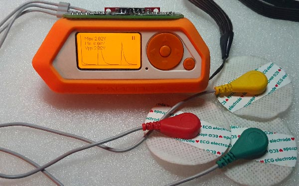
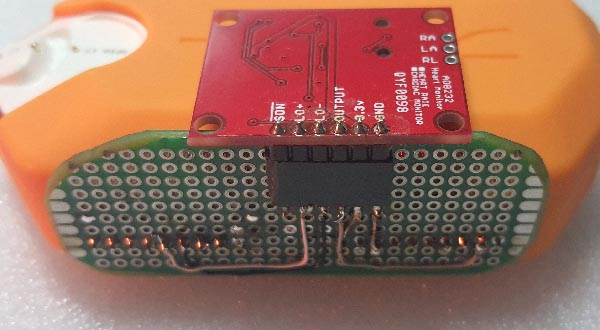

# flipper_cardiograph

To compile and install

git clone https://github.com/flipperdevices/flipperzero-firmware.git

cd flipperzero-firmware/applications_user 

git clone https://github.com/vitalinvent/flipper_cardiograph.git

fbt fap_cardiograph

cd build\f7-firmware-D\\.extapps

explorer .

here compiled *.fap (application) files, copy to flipper cd card 'apps' dir

